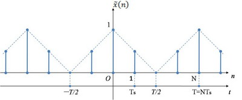
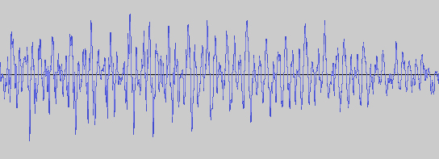

#傅立叶变换
&emsp;&emsp;前段时间做了些关于音频处理的东西，涉及到数字信号处理的一些内容。当时发现百度出来的资料很碎而且你懂得，基本都一样。就简单看了下<信号与系统>和[一个歪果仁写的书](http://www.dspguide.com/pdfbook.htm)还有coursera上数字信号处理的课，在google搜了很多，但专业术语性都太强，一时间根本就看不懂，所以尽量用大白话记录一下关于数字信号处理的内容和一些自己粗浅理解,希望能帮到以后的人理解这些东西。  
&emsp;&emsp;顺便说下，当初是因为研究音频处理时学的，所以内容更多的是以音频为例子的。
###离散和连续
&emsp;&emsp;首先是信号离散和连续的关系，其实字面上就可以看出区别，就是一个是离散的信号，一个是连续的信号。简略的用下图表示下,  
  
虚线所标示的就是连续的信号，蓝色的点则代表离散的信号，简单来说离散信号就是在连续信号上每隔一段距离取值组成的信号。  
&emsp;&emsp;连续的信号一般叫模拟信号记作x(n)，离散的信号叫数字信号记作x[n]，由于现在存储和传输的基本上都是数字信号，所以主要讨论的是离散信号的知识。
###关于采样
&emsp;&emsp;首先，模拟信号和数字信号是可以相互转换的，就是常听到的数字－模拟转换器，模拟－数字转换器。其次，他们能够相互转换是有一定条件的，就是要符合采样定理。
&emsp;&emsp;采样定理是美国工程师奈奎斯特提出的，像这样对社会贡献很大的科学家，我必须要提一下他的名字，表示对他们的尊敬，不至于只知道定理的名字而不知道提出他们的人是谁。  
&emsp;&emsp;回到正题，什么是采样定理。就是当采样频率大于信号中最高频率的2倍时，离散信号就可以完整的转换成连续的信号。  
&emsp;&emsp;想说清楚的话这里得先说明几个东西。  
&emsp;&emsp;一个是什么是采样频率，举个简单的例子。先要想明白人发出来的声音肯定是连续的，但是录音的时候不管是电脑还是手机记录的都是间隔非常小的离散的信号，这也容易想明白。假如有一个1秒钟的声音片段，那么在这1秒钟取了44.1x1000个间距相等点，这个采样率就是44.1kHz。   
&emsp;&emsp;还有一个关于信号的特征，就是任何一个连续周期信号都可以由一组频率不同的正弦曲线组成。可以先看下下一节关于对这个特征的补充。具体可以看一下[这篇文章](http://blog.jobbole.com/70549/)，由于被转了太多次，也不知道原出处在哪。<!--建议看完并大概理解文章的内容，个人认为这篇文章将时域和频域以及信号的组成讲的很清楚了，-->如果看不太懂，理解了第二节中“任何你能想到的波形都是由不同频率的正弦波叠加起来的“就可以，剩下的文章等看完我写的再看就好理解了。  
&emsp;&emsp;现在举个关于采样定理例子（这个例子可能会偏向于音频更专业化点，能看懂大概意思就好，不用深究）你可以想象一个音频的图像，如下图  
  
（自己截的图，可能效果不是很好）这是个采样频率为44.1kHz的录制人声音频的一个小片段，它看起来像是个连续的信号，是因为它每相邻的两个点都用直线连起来了，本质上还是很多离散的点，但是这些离散的点能够还原出录音时，人所发出声音的所有信息。为什么呢，简单说明下，我们听到声音是由声波的频率决定的（理解不了的话百度一下，实在嫌麻烦就记住好了），人能听到和发出的声波的频率范围大概在20到20kHz之间。根据采样定理，我们可以保证在低于 44.1k/2 = 22.05kHz 的频率正弦波都能被还原出来，也就是保证了录音时人声所发出的全部信息。所以44.1kHz也是无损音乐的标准采样频率。
###关于信号的特征
&emsp;&emsp;任何一个连续周期信号都可以用一组频率不同的正线组成。这个其实我也是被迫接受，因为咱们的大脑并没有那些科学家一样。当时是由傅立叶提出的，任何周期函数都可以用正弦函数和余弦函数构成的无穷级数来表示，这个后面会慢慢说。现在你只需要记住”任何一个连续周期信号都可以用一组频率不同的正线组成“。注意这里的“周期”两个字。
&emsp;&emsp;现在假设一个信号x[n]周期为T,则x[n+T]=x[n]